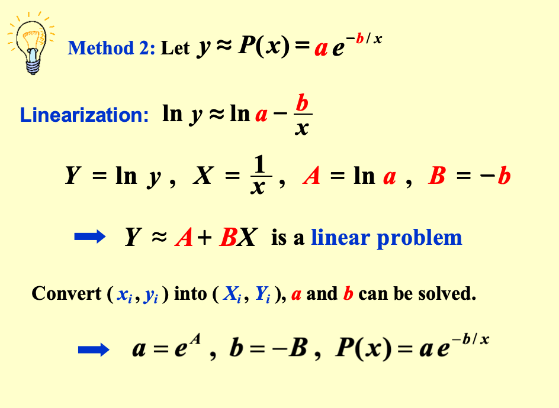

# Chapter 8 Approximation Theory

## 1 Discrete Least Square Approximation

#### 目标

确定一个多项式 \(P_n(x) = a_0 + a_1 x + \ldots + a_n x^n \)，用于近似表示一组数据 \(\{(x_i, y_i) \mid i = 1, 2, \ldots, m\}\) 使得最小二乘误差 $E_2 = \sum_{i=1}^m [P_n(x_i) - y_i]^2$ 最小化，其中 \( n \leq m \)。

#### 关键思路

\(E_2\) 实际上是一个关于 \( a_0, a_1, \ldots, a_n \) 的函数，即 $E_2(a_0, a_1, \ldots, a_n) = \sum_{i=1}^m [a_0 + a_1 x_i + \ldots + a_n x_i^n - y_i]^2$ 

要想让 \(E_2\) 最小化，必要条件是 $\frac{\partial E_2}{\partial a_k} = 0, \quad k = 0, \ldots, n$

$$\begin{aligned}
0 &= \frac{\partial E_2}{\partial a_k} \\
  &= 2 \sum_{i=1}^m [P_n(x_i) - y_i] \frac{\partial P_n(x_i)}{\partial a_k} \\
  &= 2 \sum_{i=1}^m \left[ \sum_{j=0}^n a_j x_i^j - y_i \right] x_i^k \\
  &= 2 \left\{ \sum_{j=0}^n a_j \left( \sum_{i=1}^m x_i^{j+k} \right) - \sum_{i=1}^m y_i x_i^k \right\}
\end{aligned}
$$

令 $b_k = \sum_{i=1}^m x_i^k, \quad c_k = \sum_{i=1}^m y_i x_i^k$

则可得线性方程组：

$$\begin{bmatrix}
b_{0+0} & \cdots & b_{0+n} \\
\vdots & \ddots & \vdots \\
b_{n+0} & \cdots & b_{n+n}
\end{bmatrix}
\begin{bmatrix}
a_0 \\
\vdots \\
a_n
\end{bmatrix}
=
\begin{bmatrix}
c_0 \\
\vdots \\
c_n
\end{bmatrix}
$$

该方程组称为**法方程**或**正规方程**，解之可得多项式系数 \( a_0, a_1, \ldots, a_n \)。

我们通过对所有未知数 $a_k$ 求偏导并令其为 0，导出了一个 $n+1$ 元的线性方程组。这个方程组的系数 ($b$) 和常数 ($c$) 都可以通过我们的数据 $x_i, y_i$ 计算出来。解这个方程组，就能得到 $a_0, \dots, a_n$，也就是我们的“最佳拟合”多项式。

- **$(x_i, y_i)$**
    - 这是**数据**,从实验、调查或表格里拿到的**已知、固定的点**。
    - 在 $E_2$ 的公式里，所有的 $x_i$ 和 $y_i$都是**常数**。你*不能*改变它们。
- **$a_0, a_1, \dots, a_n$**
    - 这是要找的**未知数**。它们是多项式 $P_N(x) = a_0 + a_1x + \dots + a_n x^n$ 的**系数**。
    - 我们的**目标**就是找到最好的一组 $a_k$，使得这个多项式能“最好地”拟合那些固定的数据点。
- $E_2$：
    - 它的值取决于**选择**了哪一组 $a_k$。
    - 如果选了一组很烂的 $a_k$，画出来的曲线离所有点都很远，$E_2$ 的值就**很大**。
    - 如果选了一组完美的 $a_k$，画出来的曲线“穿过”所有点的中间，$E_2$ 的值就**很小**。

!!! qustion "$E_2$最小化的必要条件为什么是这样？"
    对于曲面，有很多个方向（$a_0$ 轴方向、$a_1$ 轴方向……$a_n$ 轴方向）。

    在“谷底”的必要条件是什么？

    在“谷底”，这个曲面必须在所有方向上都是“平”的。

    - 如果只“拨动” $a_0$（保持所有其他 $a_k$ 不变），曲线在 $a_0$ 方向上的斜率必须是 0。这个“斜率”就是**偏导数** $\frac{\partial E_2}{\partial a_0}$。
    - 如果只“拨动” $a_1$（保持所有其他 $a_k$ 不变），曲线在 $a_1$ 方向上的斜率也必须是 0。这就是 $\frac{\partial E_2}{\partial a_1}$。
    - ...
    - 这个条件必须对**所有变量**都成立。
  
    **总结**

    为了让 $E_2$ 最小，我们必须处在一个“多维的谷底”。这个点的特征是，无论你沿着哪个变量 $a_k$ 的轴线（方向）移动，这一点切线的斜率都是 0。

    - 在 $a_0$ 方向上是平的 $\Rightarrow \frac{\partial E_2}{\partial a_0} = 0$
    - 在 $a_1$ 方向上是平的 $\Rightarrow \frac{\partial E_2}{\partial a_1} = 0$
    - ...
    - 在 $a_n$ 方向上是平的 $\Rightarrow \frac{\partial E_2}{\partial a_n} = 0$

    把这 $n+1$ 个条件合在一起，就是：

    $\frac{\partial E_2}{\partial a_k} = 0$ 对于所有的 $k = 0, 1, \dots, n$

- $P_n(x)$ 的顺序由用户给出，且必须不得超过 $m−1$。若 $n=m−1$，那么 $P_n(x)$ 就是 $E_2=0$ 的拉格朗日插值多项式。~~因为最小二乘法存在的意义就是处理大批有可能有误差的实验数据呀！~~
- 不强制要求 $P_n(x)$ 是一个多项式

## 2 Orthogonal（正交） Polynomials and Least Squares Approximation
Given a function \( f(x) \) defined on \([a, b]\). Find a simpler function \(P(x) \approx f(x)\) such that \(E = \int_a^b [P(x) - f(x)]^2 dx\) is minimized.

!!! Note "Definition 2.1"
    The set of functions \(\{ \varphi_0(x), \varphi_1(x), \ldots, \varphi_n(x) \}\) is said to be **linearly independent（线性无关）** on \([a, b]\) if, whenever \(a_0 \varphi_0(x) + a_1 \varphi_1(x) + \ldots + a_n \varphi_n(x) = 0 \quad \text{for all } x \in [a, b],\), we have  
    \(a_0 = a_1 = \ldots = a_n = 0.\)

    Otherwise the set of functions is said to be **linearly dependent（线形相关）**.

类似于一组线性无关的向量可以被称之为base（基）。

把向量空间中的线性无关推广到函数空间。

!!! abstract "Theorem 2.1"
    If \(\varphi_j(x)\) is a polynomial of degree \(j\) for each \(j = 0, \ldots, n\), then  
    \(\{\varphi_0(x), \varphi_1(x), \ldots, \varphi_n(x)\}\) is linearly independent on any interval \([a, b]\).
    每个多项式阶数是不一样的。

??? success "Proof"
    If not, then there exist \(a_0, a_1, \ldots, a_n\) such that  
    \(P(x) = a_0\varphi_0(x) + a_1\varphi_1(x) + \ldots + a_n\varphi_n(x) = 0 \quad \text{for all } x \in [a, b].\)

    \(P(x)\) is a zero polynomial.  

    The coefficient of \(x^n\) is zero.  

    \(a_n = 0\)  

    \(P(x) = a_0\varphi_0(x) + \ldots + a_{n-1}\varphi_{n-1}(x) = 0\)  

    \(a_{n-1} = 0\)  

    ......

    \(a_0 = 0\)

!!! abstract "Theorem 2.2"
    Let \(\prod_n\) be the set of all polynomials of degree at most \(n\). If \(\{\varphi_0(x), \varphi_1(x), \ldots, \varphi_n(x)\}\) is a collection of linearly independent polynomials in \(\prod_n\), then any polynomial in \(\prod_n\) can be written uniquely as a linear combination of \(\varphi_0(x), \varphi_1(x), \ldots, \varphi_n(x)\).

!!! Note "Definition 2.2"
    For a general linear independent set of functions \(\{\varphi_0(x), \varphi_1(x), \ldots, \varphi_n(x)\}\), a linear combination（线性组合） of \(\varphi_0(x), \varphi_1(x), \ldots, \varphi_n(x)\),  
    \(P(x) = \sum_{j=0}^n a_j \varphi_j(x)\)
    is called a **generalized polynomial（广义多项式）**.

Other Polynomials：

- \(\{\varphi_j(x) = \cos jx\}, \quad \{\psi_j(x) = \sin jx\} \Rightarrow \{\varphi_j(x), \psi_j(x)\}\) generates **trigonometric polynomial（三角多项式）**.（傅里叶级数）
- \(\{\varphi_j(x) = e^{k_j x}, \quad k_i \neq k_j\}\) generates **exponential polynomial（指数多项式）**.

!!! Note "Definition 2.3"
    **The weight function**

    1️⃣ Discrete Type

    When approximating a set of discrete points \((x_i, y_i)\) for \(i = 1, \ldots, n\), we assign each error term a positive real number \(w_i\). That is, to consider minimizing \(E = \sum_{i=1}^n w_i [P(x_i) - y_i]^2\).
    The set of \(\{w_i\}\) is called the **weight**. The purpose of the weight is to assign varying degrees of importance to approximations on certain points.
    
    某个点权重越大，我们越需要领$P(x_i)$
    接近$y_i$来降低$E$。设置权重能够不同点不同的“重要程度”，以便实现更好的近似。

    此时组合系数是我们的变量。

    2️⃣ Continuous Type

    An integrable function \(w\) is called a **weight function** on the interval \(I\) if \(w(x) \geq 0\) for all \(x\) in \(I\), but \(w(x)\) does not vanish on any subinterval of \(I\). We are to consider minimizing \(E = \int_a^b w(x)[P(x) - f(x)]^2 dx\).

如果两个函数内积等于零，称这两个函数为**正交**的。

对于一般函数 \((f, g)\)：

离散版本：
\(
  \sum_i f_i g_i = (f_1 f_2 \ldots f_n)
\begin{pmatrix}
g_1 \\
g_2 \\
\vdots \\
g_n
\end{pmatrix} = (f)^T(g)
\)

连续版本：
\(
\int_a^b f(x) g(x) dx
\)

若带有权重函数，即 \((f, g)_w\)：

离散版本（带权重）：
\(
\sum_i w_i f_i g_i = (f_1 f_2 \ldots f_n)
\begin{pmatrix}
w_1 & 0 & \cdots & 0 \\
0 & w_2 & \cdots & 0 \\
\vdots & \vdots & \ddots & \vdots \\
0 & 0 & \cdots & w_n
\end{pmatrix}
\begin{pmatrix}
g_1 \\
g_2 \\
\vdots \\
g_n
\end{pmatrix} = (f)^T [w](g)
\)

连续版本（带权重）：\(\int_a^b w(x) f(x) g(x) dx\)