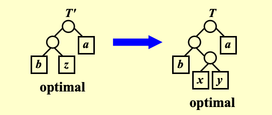

# Greedy Algorithms
## 1 Introduction
### 1.1 优化问题与贪心法
贪心算法一般是针对解决优化问题的。在回溯算法中，我们提到了“优化函数”。如给定一组约束条件和一个优化函数。满足约束条件的解称为可行解。使优化函数值达到最优的可行解称为最优解。 

!!! note "贪心法"
    在每个阶段，根据某种准则做出最佳决策。在一个阶段做出的决策在后续阶段不会改变，因此每个决策都应确保可行性。

### 1.2 全局最优/局部最优
只有当**全局最优 = 局部最优**，贪心法才能得到严格意义上的最优解，但是很多情况下贪心算法**不能保证**找到最优解。

它通常能生成非常接近最优解的解（启发式算法），因此当寻找最优解耗时过长时，贪心算法is intuitively appealing.

### 1.3 最大优点
快，效率高，一步到位。可以用贪心法快速得到一个还不错的可行解作为比较的对象。

回溯法和动态规划在枚举过程中有可能很慢。

可以用贪心法来快速估计一个解，不一定是全局最优，但可以是局部最优，（没有那么好，也没有那么坏）。
!!! tip "梯度下降"
    一种训练模型的算法，本质上也是一种贪心算法。

## 2 Activity Selection Problem
### 2.1 Example
Given a set of activities \( S = \{a_1, a_2, \ldots, a_n\} \) that wish to use a resource (e.g. a classroom). Each \( a_i \) takes place during a time interval \({[}s_i, f_i{)}\).

Activities \( a_i \) and \( a_j \) are compatible if \( s_i \geq f_j \) or \( s_j \geq f_i \) (i.e. their time intervals do not overlap).

尽可能找到相容的两个活动：活动一结束时间早于活动二或者活动二结束时间早于活动一。

Select a maximum-size subset of mutually compatible activities.

{width="100%".center}

??? question "思考：怎么用DP来解决这个问题？"

    假设所有活动先按照结束时间排序。

    $C_{i j}$是第$i$门课开始以后，第$j$门课开始以前，能够放下的最多的课程数。将一个特定的时间区间作为状态。

    $$
    a_1 \ a_2 \ \cdots \ \underbrace{a_k \ \cdots \ a_j}_{S_{ij}} \ \cdots \ a_n
    $$

    $$
    c_{ij} = 
    \begin{cases} 
    0 & \text{if } S_{ij} = \emptyset \\ 
    \max\limits_{a_k \in S_{ij}} \{ c_{ik} + c_{kj} + 1 \} & \text{if } S_{ij} \neq \emptyset 
    \end{cases}
    $$

    用二维数组表示这种状态 $f[i][j]$，很明显动态规划的时间复杂度为$O( N^2 )$。

    但是，当单个活动时间很长时，数组就爆掉了。并且，用时间定义状态会有非常多的浪费，因为我们只考虑端点，中间的时间节点都浪费了。

    用活动的编号来代替时间？没法状态转移！没法保证相容，因为只确保结束时间是有序的，没有管理开始时间。

    把时间定义改成两个开区间就可以转移状态。~~（其实这句话我没懂）~~

### 2.2 记忆化搜索
当状态的查找顺序 $i、j$ 没有那么明确，可以写成迭代的形式。

```c
//定义函数
DP(i, j){
    for(k= ...)
        if(F[i][k] == -1 ｜｜ F[k][j] != -1) //这两个子状态没有被计算过
            DP(i,k);
            ...
        else
            // F[i][j]=（根据状态方程计算）;
}
```
### 2.3 Greedy Rule
❌ Greedy Rule 1: Select the interval which **starts earliest** (but not overlapping the already chosen intervals) 

❌ Greedy Rule 2: Select the interval which is the  **shortest** (but not overlapping the already chosen intervals) 

❌ Greedy Rule 3: Select the interval **with the fewest conflicts** with other remaining intervals (but not overlapping the already chosen intervals) 

✅ Greedy Rule 4: Select the interval which **ends first** (but not overlapping the already chosen intervals) 

Resource become free as soon as possible.
结束的越早越能把这资源给空出来。

!!! question "🤔如何证明一个贪心法的正确性？"
    1️⃣ Algorithm gives non-overlapping intervals（可行解证明，替换之后是否会发生冲突？易）

    2️⃣ The result is optimal（最优解证明，难）

    （类似动态规划最优子结构的证明：）假设最优解的第一个元素$a_{ef}$不是贪心法求出来的第一个元素$a_m$，尝试用贪心法求出来的第一个元素替换它，看能不能替换/替换之后会不会变得更差（只要不变得更差就行）。

    像分治法，拿出 $S_1$，规模为$N$的原问题依赖于更小规模（$N-1$）子问题的最优解而不是它本身的次优解。

!!! abstract "Theorem"
    考虑任意非空子问题 $S_k$，并设 $a_m$ 是 $S_k$ 中具有最早结束时间的活动。那么 $a_m$ 必定包含在 $S_k$ 的某个最大兼容活动子集中。

!!! success "Proof"
    设 $A_k$ 是最优解集， $a_{ef}$ 是 $A_k$ 中具有最早结束时间的活动。
    $a_m$ 一定早于 $a_{ef}$，所以肯定是不会和后面第二个活动冲突。

    如果 $a_m$ 和 $a_{ef}$ 相同，则证明完毕！否则 ......
    用 $a_m$ 替换 $a_{ef}$ 得到 $A_k'$。
    由于 $f_m \le f_{ef}$，$A_k'$ 是另一个最优解。

$T = O( N log N )$


### 2.4 Another Look at DP Solution 🧐
~~这里我没听懂为什么上面那种DP是在求序列，而这里在求集合（上面要求选取顺序，这里不选取）~~

$$c_{1,j} = \begin{cases} 1 & \text{if } j=1 \\ \max\{c_{1,j-1}, c_{1,k(j)} + 1\} & \text{if } j>1 \end{cases}$$

两种可能情况：最后一门课选还是不选？

where $c_{1,j}$ is the optimal solution for $a_1$ to $a_j$, and $a_{k(j)}$ is **the nearest compatible activity** （从后往前不冲突的第一门） to $a_j$ that is finished before $a_j$.

If each activity has a weight ...

Q1: Is the Greedy solution still correct?
❌不能贪心了

Q2: Is the DP solution still correct?
✅

$$c_{1,j} = \begin{cases} w_1 & \text{if } j=1 \\ \max\{c_{1,j-1}, c_{1,k(j)} + w_j\} & \text{if } j>1 \end{cases}$$


### 2.5 状态转移
动态规划：一个第N个原问题，依赖于上一个状态的子问题，具体是哪个是不知道的，是需要枚举的。
贪心：状态转移是唯一的。问题规模为N的问题一定是有N-1转移过来的，以此类推。

??? info "Elements of the Greedy Strategy"
    Cast the optimization problem as one in which we make a choice and are left with one subproblem to solve.

    Prove that there is always an optimal solution to the original problem that makes the greedy choice, so that the greedy choice is always safe.

    Demonstrate optimal substructure by showing that, having made the greedy choice, what remains is a subproblem with the property that if we combine an optimal solution to the subproblem with the greedy choice we have made, we arrive at an optimal solution to the original problem.

    Beneath every greedy algorithm, there is almost always a more cumbersome dynamic-programming solution


## 3 Huffman’s Algorithm
离散数学中讲过。

频率越高使用的bit数更少/1更少。
代价就是字符在树中的深度。

**The trick is: No code is a prefix of another.**
任何一个字符不能是另一个字符的前缀。

👁️ Any sequence of bits can always be decoded unambiguously if the characters are placed only at the leaves of a full tree（要么两个孩子要么没有孩子） – such kind of code is called prefix code.

每次合并两个出现频率最低的，将它俩的频率之和作为父节点的值，再在接下来的节点里找两个频率最低的，以此类推。最后往左标0，往右标1。

!!! question "❓如何证明正确性"
    1️⃣ 整棵树满足值在叶子节点/full tree的要求，因此叶子节点的替换不会造成非法的解。

    2️⃣ 显然，把频率更低的解放到最深的地方，频率高的放到浅的地方，因此不会让整棵树代价变得更大。

    3️⃣ **证明最优子结构（即原问题的最优解依赖于子问题的最优解）**（一般用反证法证明）

    
        
    假设 $T'$ 为子问题的最优解，其不能导出原问题的最优解，导出的是原问题的次优解 $T$ 。
        
    我们对原问题做一个变化。假设原问题最优解 $T^*$ ，（结论）一定在最深的位置是 $x、y$ ，第一步已经证过了。把 $x、y$ 合并成 $z$ ，得到 $T'^{*}$ 得到 $abxy$ 的子问题。

    $$
    T'^{*} = T^* - f(x) - f(y) < T - f(x) - f(y) = T'
    $$

    我们导出了一个比子问题最优解 $T'$更优的解，矛盾。


